# Yagiz Katerli

I build systems where AI agents do real work and the system can tell whether they actually did it.

Mathematical Engineering @ ITU · Istanbul

  

### What I build

Reliable paths from an idea to a running system: queues, leases, CI gates, evaluation harnesses,
observability, and audit trails. The standard is simple: a result should be measurable by an independent reader
who did not write the claim.

### Projects

| project | one honest line |
|---|---|
| **lobby** | An asynchronous workspace for thinking with AI. *(Private snapshot; access on request.)* |
| **agent-fleet** | Infrastructure for running many AI agents in parallel and measuring whether the work happened. *(Private snapshot; access on request.)* |
| **[herakles-eval-lab](https://github.com/yagizkaterli/herakles-eval-lab)** | An evaluation harness for separating real completion from polished fake completion. *(Public evaluation snapshot.)* |

### Measured snapshots

Local measurements from 2026-08-09:

- `lobby`: 167 commits, 45 tracked TypeScript files at `HEAD 5cdd95c`.
- `agent-fleet`: 4,286 implementation Go lines, 2,455 test Go lines, 47 test functions at `HEAD 6906c83`.
- `herakles-eval-lab`: 16 commits, 20 Python files, 4 golden files at `HEAD cd038c9`.

### Method

Portable working discipline, extracted as public skills:

- [foundation](https://github.com/yagizkaterli/foundation)
- [frictionless](https://github.com/yagizkaterli/frictionless)
- [human-steps](https://github.com/yagizkaterli/human-steps)
- [perfect-form](https://github.com/yagizkaterli/perfect-form)
- [idea-boost](https://github.com/yagizkaterli/idea-boost)

### Working with

`Go` · `Python` · `TypeScript` · `SQL` — queues, leases, CI gates, multi-model orchestration,
evaluation harnesses, observability, and audit trails.

### Also

Jazz drums. Basketball analysis. Philosophy of mind, read slowly.

**Open to** research engineering and evaluation roles — San Francisco, New York, Chicago, or
remote. Visa sponsorship required.

📫 yagizkaterli@gmail.com · [LinkedIn](https://linkedin.com/in/yagizkaterli)